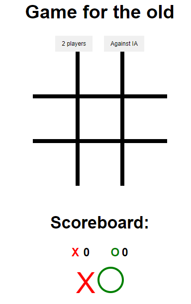

# Game for the old

first practical project of the **_Javascript course from basic to advanced (with Node.js and projects) taught by Matheus Battisti_**, in the game it is possible to play with 2 players or play directly with the computer

